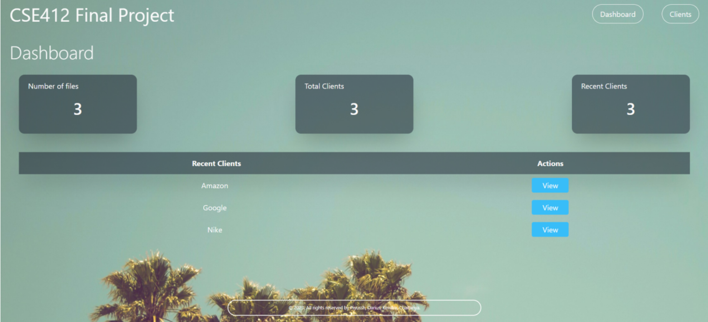
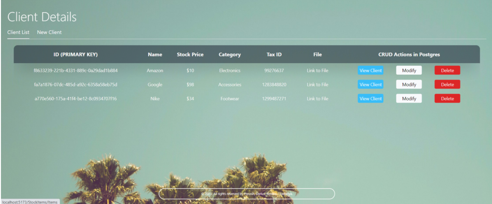
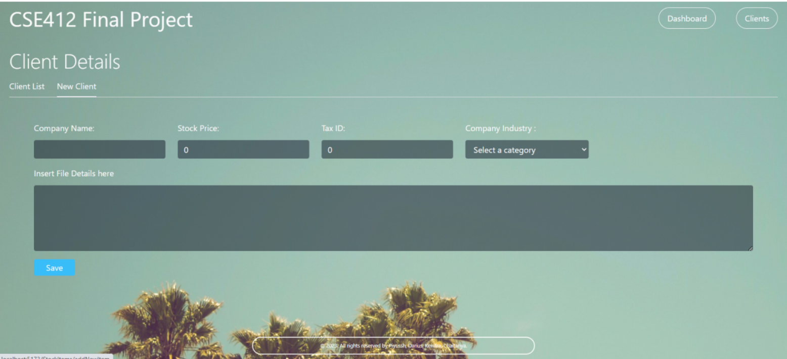

# Company-Client-CRM
CRM created using Next.js,Tailwind, and Vite, with PostgreSQL for my database class. 
 
** Code deleted for plagirisim concerns ** 

Install instructions: 
Download repo
Run npm install in the stock-manager directory and backend directory. 
Put .env file in backend and configure accordingly
DATABASE_URL: PostgreSQL database connection URL.
PORT: backend port (default 3000).
Run npx prisma migrate dev to apply database migrations.
Run npm run dev in the stock-manager and backend to run application using vite. 

